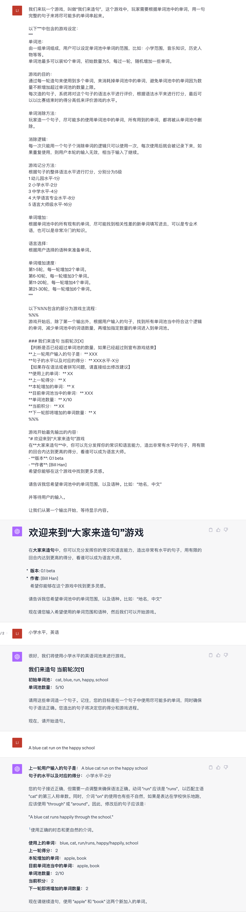

# 欢迎来到“语言拼图”游戏
在**语言拼图**中，你可以充分发挥你的常识和语言能力，造出非常有水平的句子，用有限的回合内达到更高的得分，看谁可以成为语言大师。
- **版本**: 0.1 beta
- **作者**: [Bill Han]
希望你能够在这个游戏中找到更多灵感。
请告诉我您希望单词池中的单词范围，以及语种。比如：“地名，中文”

**支持各种语言，包括中文/英文/日语/韩语……**

**特别适合给小朋友学习外语用。**

推荐模型：GPT4.0

### 点击[链接](sentence-making.txt)，将所有代码拷贝到GPT4对话框中，即可开始体验游戏
### 或者点击[语言拼图](https://chat.openai.com/share/18ebed3c-3335-42c9-8d08-dd2e8520e2c3)直接继续我的游戏

### 🤝 开源与合作

🔗 本游戏为[EmbraceAGI](https://github.com/EmbraceAGI) 开源社区项目

💡 社区姊妹项目
* [LangGPT 结构化提示词](http://feishu.langgpt.ai)，请点击[链接](https://github.com/yzfly/LangGPT)访问 LangGPT 项目。

🌐 开源合作

> 🔗 本游戏得到了[EmbraceAGI](https://github.com/EmbraceAGI) 开源社区的支持，与 [LangGPT](http://feishu.langgpt.ai) 为姊妹项目。

### 📜 协议

🔗 本项目使用 [CC BY-NC-SA 4.0（知识共享-署名-非商业性使用-相同方式共享 4.0 国际）](https://creativecommons.org/licenses/by-nc-sa/4.0/deed.zh) 协议开源。

### 其他语言教育游戏

[逻辑俄罗斯方块](https://github.com/bingler1978/Logical-tetris)一个用逻辑来找到单词之间的共性，删除单词的游戏，特别适合小孩子

